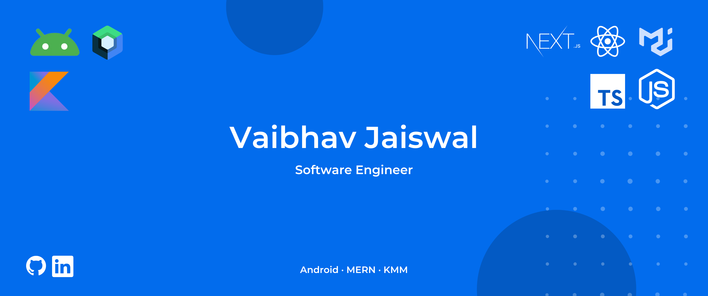

<h1 align="center">Hello There! I'm <a href='https://vaibhavjaiswal.vercel.app/#/'>Vaibhav Jaiswal</a> </h1>

<p align='center'>
<a href="https://www.linkedin.com/in/vaibhav-jaiswal-8612621b7/" target="blank"></a>
<a href="https://github.com/Vaibhav2002" target="blank"></a>
<a href="https://auth.geeksforgeeks.org/user/vaibhav02/profile" target="blank"></a>
<a href="https://leetcode.com/vaibhav_jaiswal/" target="blank"></a>
<a href="https://www.codechef.com/users/vaibhav2511" target="blank"></a>
<a href="https://www.hackerrank.com/vaibhav_jaiswal3" target="blank"></a>
<a href="https://medium.com/@vaibhav3011"></a>
 <a href="https://twitter.com/VaibhavJais02"></a>
<br><br>

---

<br>


## I'm a Computer Science and Engineering Student  

- 👨‍💻 I’m currently working on Android Development, MERN Stack Development and Kotlin Multiplatform.
- 📚 I’m currently learning everything about MERN Stack Development using NextJS 😅
- 💪🏼 Future Goals: Learn more technologies - Never stop creating new ideas.
- ⚡ Fun fact: I love to play video games like CS:GO.
<br>

---

### Languages 🛠 
[](https://skillicons.dev)

### Development Frameworks and Libraries
[](https://skillicons.dev)

### Databases and Cloud Platforms 🛠 
[](https://skillicons.dev)

### IDEs and Tools
[](https://skillicons.dev)

### Socials
[](https://skillicons.dev)
---

<br/>
<h2 align="center"> Github Statistics 📈</h2>
 
<a href="https://github.com/anuraghazra/github-readme-stats">
  
</a>
<a href="https://github.com/anuraghazra/github-readme-stats">
  
</a>
<a href="https://github.com/anuraghazra/github-readme-stats">
  
</a><br><br>

<!--START_SECTION:waka-->

```txt
From: 30 April 2023 - To: 16 January 2024

Total Time: 759 hrs 48 mins

Kotlin                 458 hrs 17 mins ███████████████░░░░░░░░░░   60.32 %
TypeScript             236 hrs 54 mins ███████▓░░░░░░░░░░░░░░░░░   31.18 %
Python                 8 hrs 43 mins   ▒░░░░░░░░░░░░░░░░░░░░░░░░   01.15 %
XML                    6 hrs 52 mins   ▒░░░░░░░░░░░░░░░░░░░░░░░░   00.90 %
TOML                   6 hrs 51 mins   ▒░░░░░░░░░░░░░░░░░░░░░░░░   00.90 %
```

<!--END_SECTION:waka-->


